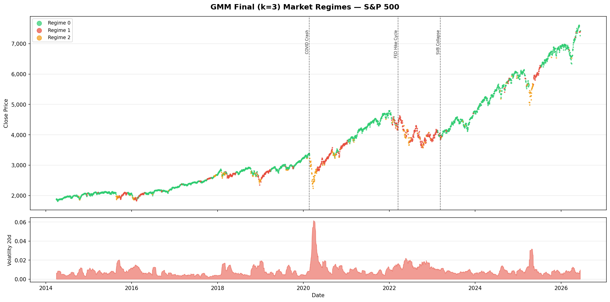
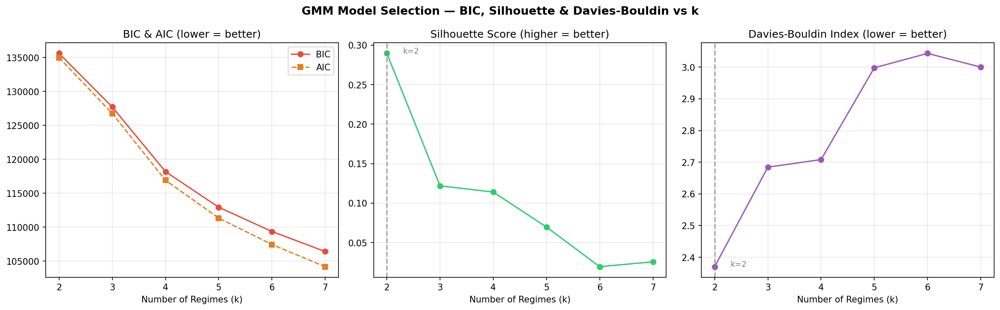
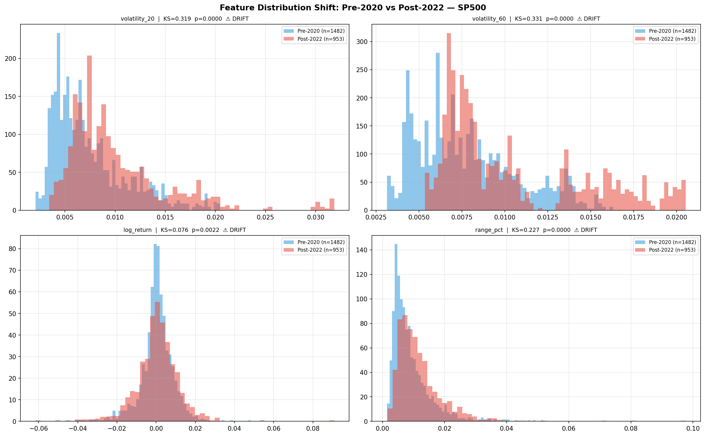

# 📈 Market Regime Detection via Unsupervised Learning

> **ECON484 — Machine Learning in Economics | Atılım University, Spring 2026**  
> Detecting hidden market states across global equity indices using GMM, K-Means, and macroeconomic event alignment.

---

## 🔍 What This Project Does

Financial markets don't move in straight lines — they cycle through distinct states of **calm, transition, and stress**. This project uses unsupervised machine learning to automatically discover these hidden regimes from raw price and volatility data, with zero human labeling.

Three global indices analyzed over **10 years (2015–2024)**:
- 🇺🇸 **S&P 500** — US large-cap equities
- 🇹🇷 **BIST 100** — Turkish blue-chip equities  
- 🇩🇪 **DAX** — German large-cap equities

---

## 🏆 Key Results

| Market | Strategy Return | Annual Return | Sharpe Ratio | BH Sharpe |
|--------|----------------|---------------|-------------|-----------|
| **S&P 500** | **+182.75%** | 8.91% | **0.763** ✅ | 0.737 |
| **BIST 100** | **+191.08%** | 9.22% | **0.600** | 1.141 |
| DAX | +2.21% | 0.2% | 0.078 | 0.507 |

> ✅ S&P 500 strategy **beats buy-and-hold on a risk-adjusted basis** (Sharpe 0.763 vs 0.737).

---

## 🧠 Methodology

### Stage 1 — K-Means Baseline
- Run for k = 2–6 with `n_init=50`
- Silhouette Score → **k = 3 optimal** across all markets
- Confirms 3 natural regimes exist: Calm/Bull · Transition · Stress/Bear

### Stage 2 — Gaussian Mixture Models (GMM)
- Full covariance, BIC-guided model selection
- Soft probabilistic assignments → continuous **Stress Score** per trading day
- Market-specific tuning: `covariance_type`, `reg_covar` optimized per index

### Stage 3 — Verification
- **Cross-tabulation**: GMM regimes vs FED / ECB / TCMB policy decisions
- **KS Drift Test**: Pre-2020 vs Post-2022 volatility distribution shift → structural break confirmed (p < 0.05) in all three markets

### Stage 4 — Alpha Lab *(extended, beyond course scope)*
> Designed and implemented by **Umut Öztürk**

A full regime-conditional trading pipeline built on top of GMM outputs:

```
early_warning.py → alpha_signal.py → portfolio_sim.py
 (Stress Score)    (BUY/HOLD/REDUCE)  (Walk-forward backtest)
```

Dynamic position sizing based on regime × stress zone combinations. No lookahead bias. Transaction costs applied.

---

## 📊 Selected Visualisations

**GMM Final Regime — S&P 500**



**GMM Model Selection (BIC / DBI)**



**Concept Drift — KS Test S&P 500**



---

## 🗂️ Repository Structure

```
ECON484-MarketRegime-Detection/
│
├── original_data/          # Raw OHLCV + engineered features + alpha signals
├── splits/                 # Temporal splits: pre_2020 · covid · post_2022
├── plots/                  # All regime visualisations, KS tests, crosstabs
│   └── alpha_charts/       # Alpha Lab backtest equity curves
│
├── code/
│   ├── download_data.py
│   ├── build_features.py
│   ├── generate_splits.py
│   ├── kmeans_baseline.py
│   ├── gmm_model_selection.py
│   ├── gmm_baseline.py
│   ├── gmm_final.py
│   ├── ks_drift_test.py
│   ├── crosstab_vv.py
│   └── alpha_lab/
│       ├── early_warning.py
│       ├── alpha_signal.py
│       ├── portfolio_sim.py
│       ├── markov_engine.py
│       ├── forward_returns.py
│       └── regime_classifier.py
│
├── ai_prompts/             # All LLM-assisted workflow documentation
├── ledger.csv              # Full experiment log (all runs, parameters, metrics)
├── ledger_explained.md     # Ledger column definitions
├── report.md               # Full academic report
└── README.md
```

---

## ⚡ How to Run

```bash
# 1. Install dependencies
pip install yfinance pandas numpy scikit-learn matplotlib scipy

# 2. Fetch data
python3 code/download_data.py

# 3. Build features
python3 code/build_features.py

# 4. Run full modeling pipeline
python3 code/kmeans_baseline.py
python3 code/gmm_model_selection.py
python3 code/gmm_final.py

# 5. Verification
python3 code/ks_drift_test.py
python3 code/crosstab_vv.py

# 6. Alpha Lab (extended)
python3 code/alpha_lab/early_warning.py
python3 code/alpha_lab/alpha_signal.py
python3 code/alpha_lab/portfolio_sim.py
```

**Python 3.9+ required.**

---

## 👥 Team

| Name | Role |
|------|------|
| **Umut Öztürk** | Lead Developer — full pipeline architecture, GMM modeling, Alpha Lab design & implementation, backtesting engine |
| Ömer Enes Yavuz | Research — central bank decision data collection, macroeconomic crisis timeline, literature review |
| Alp Artun Aydın | AI Prompt Engineering — documented all LLM-assisted workflows in `ai_prompts/`, prompt iteration and quality control |
| Gülşen Karadağ | Research — FED/ECB/TCMB policy history, cross-tabulation event sourcing, report co-editing |

**Instructor:** Bora Güngören  
**Course Repository:** [ATILIM-ECON484-Spring2026](https://github.com/boragungoren-portakalteknoloji/ATILIM-ECON484-Spring2026)

---

## 📄 License

GPL-3.0 — see [LICENSE](LICENSE) for details.
