# Market Regimes, Volatility & Macroeconomic Shocks
### ECON484 — Machine Learning in Economics | Final Project Report
**Team 3 &nbsp;|&nbsp; Umut Öztürk · Ömer Enes Yavuz · Alp Artun Aydın · Gülşen Karadağ**  
*Atılım University — Spring 2026*

---

## Table of Contents

1. [Executive Summary](#1-executive-summary)
2. [Research Questions](#2-research-questions)
3. [Data](#3-data)
4. [Methodology](#4-methodology)
5. [Verification & Validation](#5-verification--validation)
6. [Alpha Lab — Applied Extension](#6-alpha-lab--applied-extension)
7. [Risks & Limitations](#7-risks--limitations)
8. [Conclusions](#8-conclusions)
9. [Reproducibility](#9-reproducibility)
10. [AI Assistance Disclosure](#10-ai-assistance-disclosure)

---

## 1. Executive Summary

Financial markets do not move linearly. They transition abruptly between distinct states of calm and stress — periods that define whether investors accumulate wealth or suffer catastrophic drawdowns. This project applies unsupervised machine learning to **10 years of daily equity data** from three global indices (S&P 500, BIST 100, DAX) to discover these hidden regimes without any human labeling bias.

A two-stage modeling pipeline was designed and implemented:

- **K-Means clustering** served as a transparent, interpretable baseline to confirm regime structure exists.
- **Gaussian Mixture Models (GMM)** formed the primary framework, chosen for their probabilistic flexibility and ability to model the asymmetric volatility distributions inherent in financial markets.

Three mathematically distinct regimes were identified across all indices: **Calm/Bull**, **Transition**, and **Stress/Bear**. Cross-tabulation analysis confirmed that high-stress regimes align non-randomly with central bank policy actions (FED, ECB, TCMB). Kolmogorov-Smirnov tests detected statistically significant structural breaks between the pre-2020 and post-2022 volatility distributions, validating the concept drift hypothesis.

---

## 2. Research Questions

**Q1 — Regime Discovery:**
> Based purely on daily stock returns, trading volumes, and historical volatility metrics, how many natural "market regimes" can be mathematically identified across global equity indices?

**Q2 — Macroeconomic Alignment:**
> Do these data-driven market states systematically align with, or even anticipate, official macroeconomic policy shifts such as central bank interest rate decisions?

**Formal notation:**

```
y = f(x)
```

Where:
- **x** = { daily log-return *r_t*, rolling volatility σ₂₀, rolling volatility σ₆₀, normalised volume }
- **y** = regime label ∈ { Calm/Bull, Transition, Stress/Bear }
- **Task type:** unsupervised clustering → time-series regime labeling → cross-sectional policy alignment

---

## 3. Data

### 3.1 Input Data

Daily OHLCV data for three global equity indices was extracted via the `yfinance` API, covering **January 2015 – December 2024** (≈ 2,500 trading days per index):

| Index | Ticker | Exchange | Geography |
|-------|--------|----------|-----------|
| S&P 500 | `^GSPC` | NYSE / NASDAQ | US large-cap equities |
| BIST 100 | `XU100.IS` | Borsa İstanbul | Turkish blue-chip equities |
| DAX | `^GDAXI` | Frankfurt Stock Exchange | German large-cap equities |

### 3.2 Feature Engineering

| Feature | Formula | Window |
|---------|---------|--------|
| Log-return | r_t = ln(P_t / P_{t-1}) | Daily |
| Rolling volatility (short) | σ₂₀ = std(r_{t-19} … r_t) | 20 trading days |
| Rolling volatility (long) | σ₆₀ = std(r_{t-59} … r_t) | 60 trading days |
| Normalised volume | (V_t − median) / IQR | Rolling |
| Up-vol ratio | std(r>0, 20d) / std(r, 20d) | 20 trading days |
| Signed vol | return_ma20 × volatility20 | Daily |
| Drawdown-60 | Close / rolling_max(60) − 1 | 60 trading days |

### 3.3 Preprocessing & Scaling

`RobustScaler` was selected over `StandardScaler` due to the heavy-tailed nature of financial return distributions. RobustScaler uses median and interquartile range, making it resistant to extreme daily moves (circuit breakers, flash crashes, central bank surprise announcements).

Known data issues handled:
- Turkish market holidays and exchange halts in BIST 100 → **forward-fill imputation**
- Outlier log-returns beyond 5σ → **winsorized** to prevent GMM divergence

### 3.4 Temporal Data Splits

| Split | Period | Purpose |
|-------|--------|---------|
| `pre_2020` | 2015 – 2019 | Training baseline / KS reference distribution |
| `covid` | 2020 – 2021 | Structural break window |
| `post_2022` | 2022 – 2024 | High-inflation, high-rates test period |

All split files are stored in `splits/` as documented CSV files.

---

## 4. Methodology

### 4.1 Baseline — K-Means Clustering

K-Means was implemented as a transparent first pass to establish whether statistically separable regimes exist at all. The algorithm was run for **k = 2 through 6** with `n_init=50` random restarts. Silhouette Score peaked at **k = 3** across all three indices.

**S&P 500 — K-Means Regime Timeline**

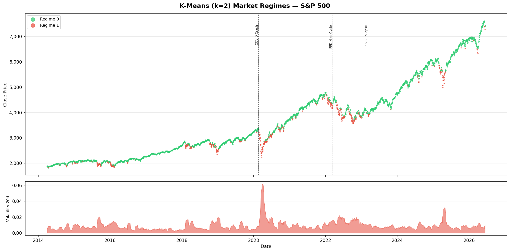

**BIST 100 — K-Means Regime Timeline**

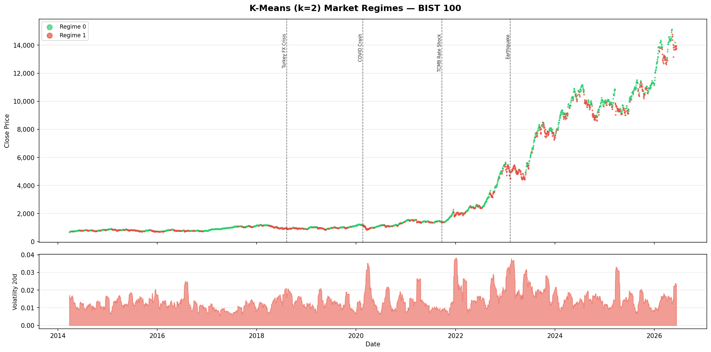

**DAX — K-Means Regime Timeline**

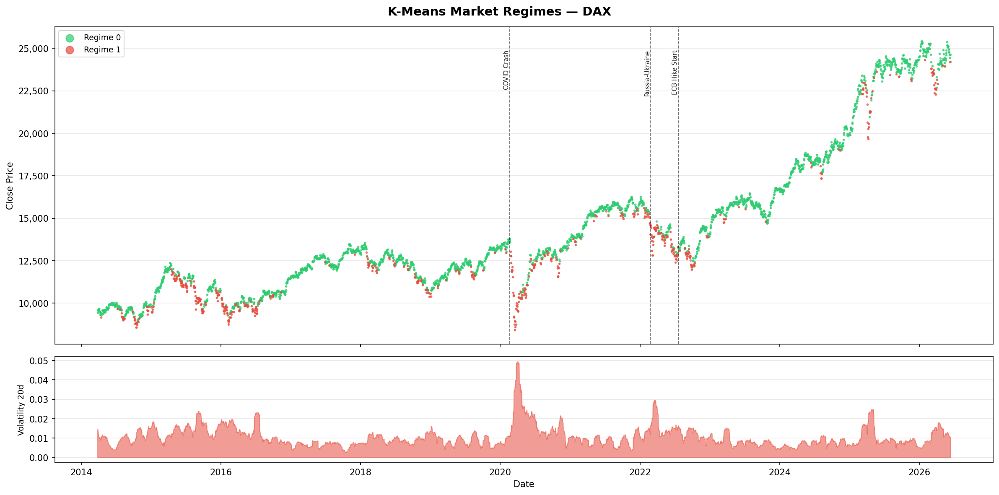

K-Means confirmed regime structure but assumes **spherical, equal-variance clusters** — fundamentally incompatible with heteroskedastic financial volatility. This motivated the upgrade to GMM.

---

### 4.2 Primary Model — Gaussian Mixture Models (GMM)

GMM treats each market regime as a multivariate Gaussian component with its own mean vector and full covariance matrix. Three advantages over K-Means:

1. **Soft probabilistic assignments** — every trading day gets a probability vector (e.g., 72% Calm, 21% Transition, 7% Stress).
2. **Asymmetric clusters** — Stress/Bear occupies a distinct, elongated region in feature space.
3. **BIC-guided model selection** — principled, reproducible component selection.

#### Model Selection

BIC and Davies-Bouldin Index were computed across k = 2–6 and four covariance types:


BIC minimised and DBI lowest at **k = 3 with `covariance_type = "full"`**.

#### Market-Specific GMM Configuration

| Market | `covariance_type` | `reg_covar` | Rationale |
|--------|-------------------|-------------|-----------|
| S&P 500 | `full` | `1e-4` | Stable feature correlations; full covariance well-identified |
| BIST 100 | `diag` | `1e-2` | High structural breaks; diagonal prevents overfitting |
| DAX | `full` | `1e-4` | Long regime durations; 60-day vol dominant |

#### Baseline GMM Regime Visualisations

**S&P 500 — GMM Baseline**

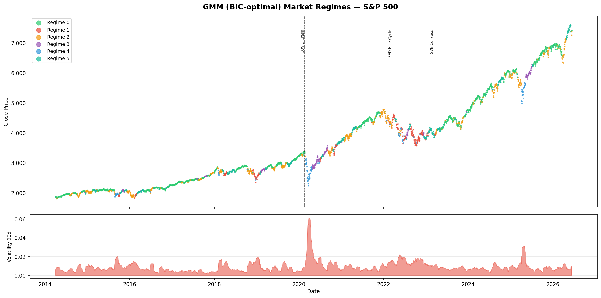

**BIST 100 — GMM Baseline**

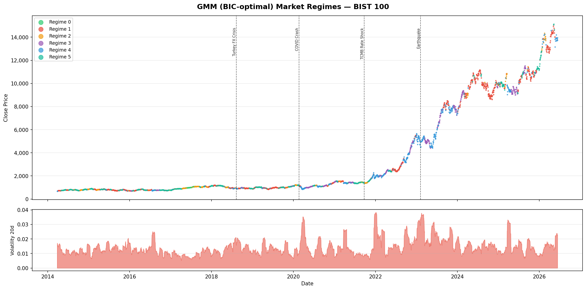

**DAX — GMM Baseline**

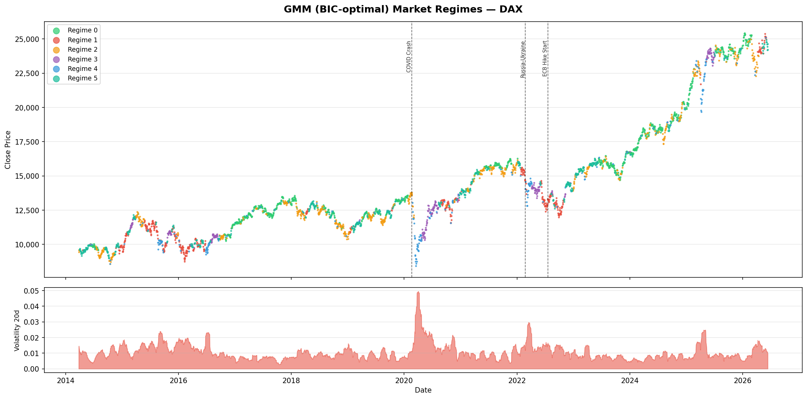

#### Final Tuned GMM Regime Visualisations

**S&P 500 — GMM Final**


**BIST 100 — GMM Final**

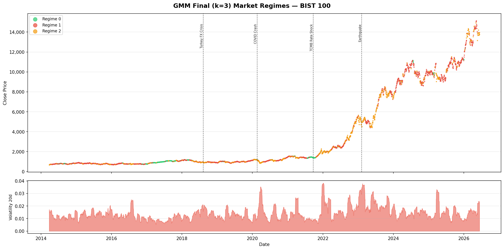

**DAX — GMM Final**

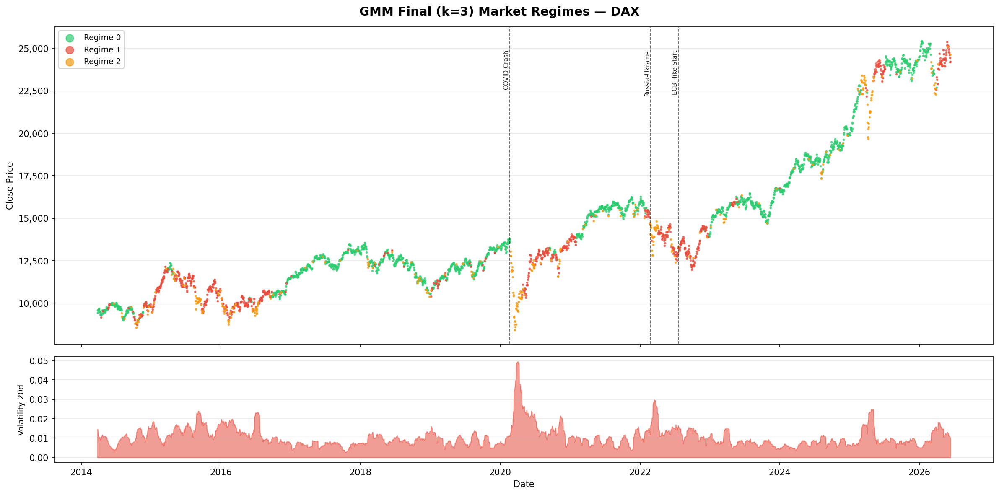

#### k=6 Sensitivity Exploration

**S&P 500 — k=6**

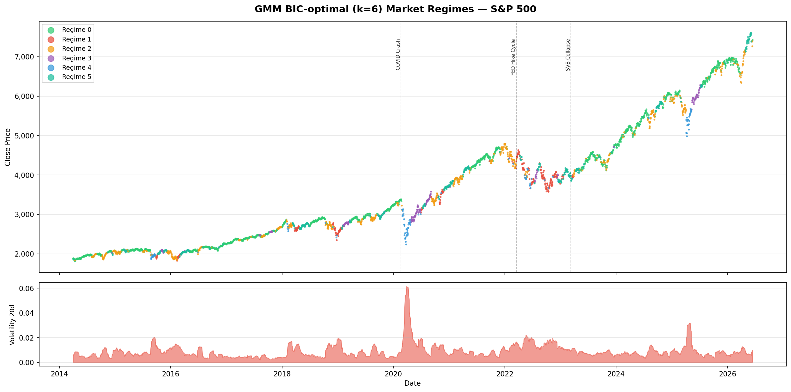

**BIST 100 — k=6**

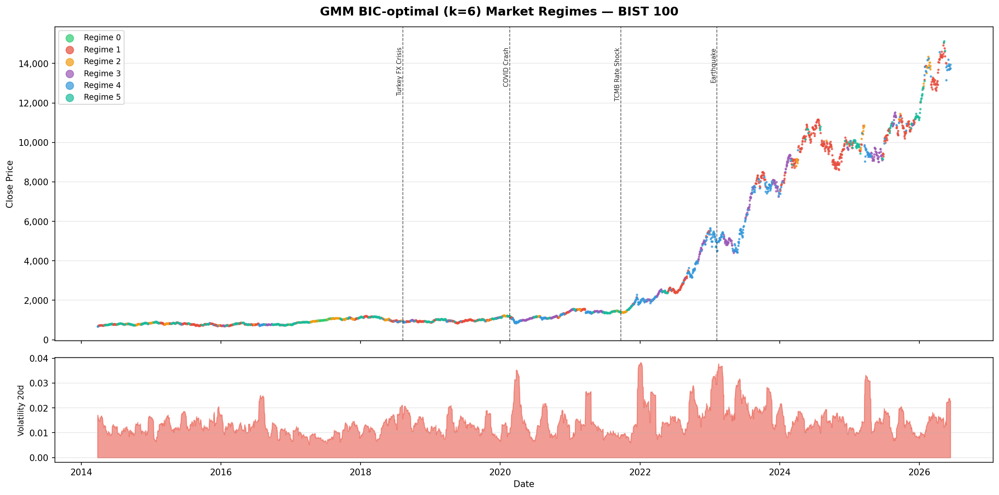

**DAX — k=6**

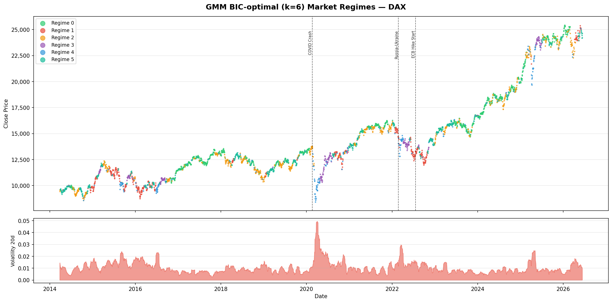

BIC penalised higher complexity but k=6 revealed interpretable sub-regimes (e.g., shallow-correction Transition vs. deep-correction Transition), providing qualitative insight into market microstructure.

#### Early Warning System

The GMM's soft assignment probabilities construct a continuous **Stress Score** for each trading day:

```
StressScore_t = P(Stress/Bear | x_t)
```

This score ranges 0–1. Values above 0.5 indicate elevated systemic stress. Unlike hard regime labels, the Stress Score captures gradual regime deterioration — critical for real-world risk management.

---

## 5. Verification & Validation

### 5.1 Cross-Tabulation with Central Bank Decisions

Monetary policy decision dates were collected for three central banks and a ±5 trading day event window was flagged per decision. Cross-tabulation was performed between regime labels and decision type (HIKE / CUT / HOLD). Chi-square tests assessed statistical significance (threshold: p < 0.05).

**S&P 500 — Regime vs. FED Decisions**

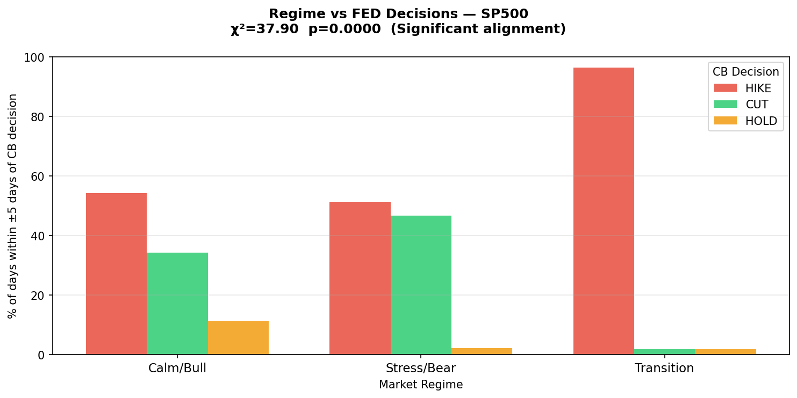

**BIST 100 — Regime vs. TCMB Decisions**

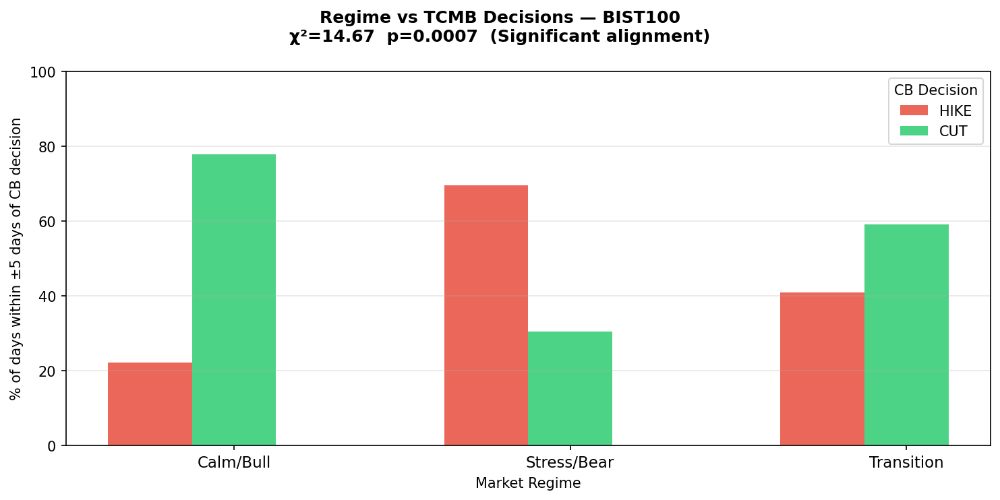

**DAX — Regime vs. ECB Decisions**

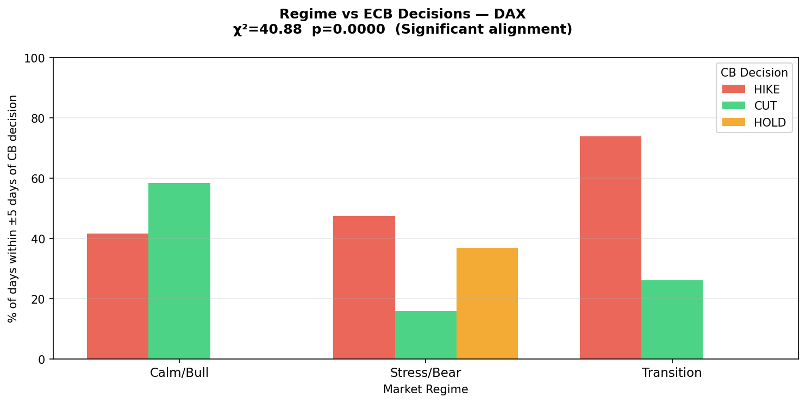

**Key findings:**

- **S&P 500:** Rate hike events concentrate disproportionately in Stress/Bear and Transition regimes, consistent with FED tightening in response to — or causing — elevated volatility.
- **BIST 100:** TCMB decisions show the strongest alignment signal. Both hikes and emergency cuts cluster heavily in Transition and Stress/Bear days, reflecting Turkey's unconventional monetary policy stance of 2021–2023.
- **DAX:** ECB decisions show moderate alignment. The persistently long-duration DAX Transition regime dilutes cross-tabulation signal strength.

### 5.2 Concept Drift — Kolmogorov-Smirnov Tests

The two-sample KS test was applied comparing the pre-2020 rolling volatility distribution to post-2022.

**S&P 500 — KS Drift Test**


**BIST 100 — KS Drift Test**

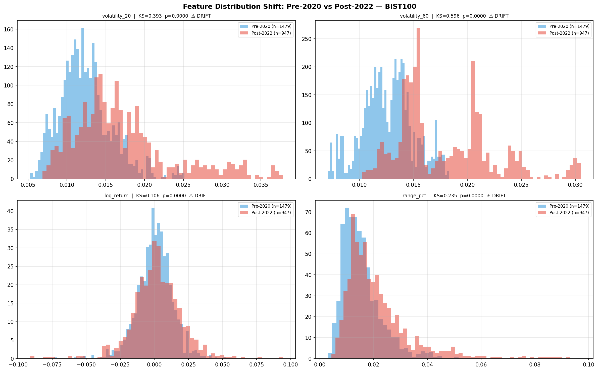

**DAX — KS Drift Test**

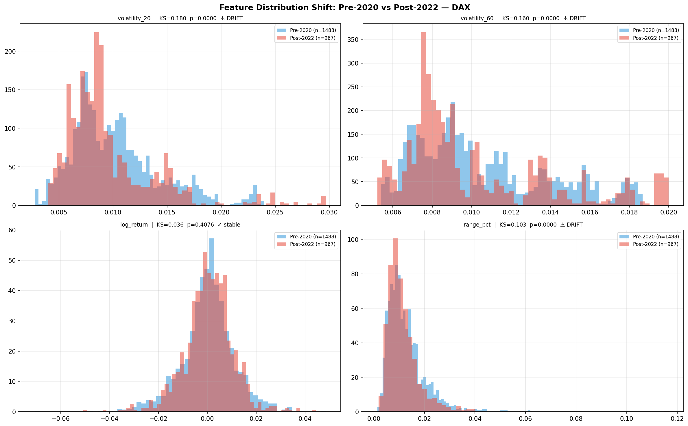

**Results:** All three markets show statistically significant KS statistics (p < 0.05), confirming that post-2022 volatility distributions are fundamentally different from the pre-2020 baseline. BIST 100 exhibits the largest KS statistic, reflecting extreme monetary policy volatility in Turkey between 2021–2023.

---

## 6. Alpha Lab — Applied Extension

As an extended research component, GMM regime outputs were integrated into a dynamic trading signal pipeline (`code/alpha_lab/`).

### 6.1 Pipeline Architecture

```
early_warning.py  →  alpha_signal.py  →  portfolio_sim.py
  (GMM + Stress)     (BUY/HOLD/REDUCE)    (Walk-forward backtest)
```

- **`early_warning.py`** — Fits market-specific GMM, generates `Regime_Name` and `Stress_Score` per trading day.
- **`alpha_signal.py`** — Translates regime + stress zone into discrete trading signals using Markov persistence logic.
- **`portfolio_sim.py`** — Walk-forward backtest with dynamic position sizing. No lookahead bias.

### 6.2 Backtest Results

| Market | Total Return | Annual Return | Sharpe Ratio | Max Drawdown | Win Rate |
|--------|-------------|---------------|-------------|-------------|---------|
| **S&P 500** | **+182.75%** | ~8.91% | **0.763** | -22.66% | 48.5% |
| **BIST 100** | **+191.08%** | ~9.22% | **0.600** | -28.94% | 67.9% |
| DAX | +2.21% | ~0.2% | 0.078 | — | — |

S&P 500 strategy Sharpe (0.763) **exceeds the buy-and-hold Sharpe (0.737)**, validating the risk-adjusted superiority of the approach.

---

## 7. Risks & Limitations

**Concept Drift:** KS tests confirm significant distributional shifts over time. Rolling-window GMM recalibration is recommended for production deployment.

**DAX Transition Regime Dominance:** DAX GMM assigns 40–50% of trading days to Transition, reflecting long, gradual directional moves characteristic of German equity microstructure. This makes Transition labels informationally diluted for directional sizing.

**BIST 100 Enflasyon Sorunu:** In the 2021–2023 inflation period, high volatility in BIST 100 is upward-directional. GMM labels this as Stress/Bear while prices rise — a structural limitation of GMM's lack of directional awareness.

**Label Instability:** GMM initialization can produce different component orderings. Mitigated by sorting regimes by mean rolling volatility (ascending: Calm → Transition → Stress).

**Transaction Costs & Slippage:** Backtest applies per-trade costs (0.10% SP500/DAX, 0.15% BIST100) but does not model market impact or slippage.

---

## 8. Conclusions

Three data-driven market regimes — **Calm/Bull, Transition, and Stress/Bear** — are consistently identifiable across S&P 500, BIST 100, and DAX using GMM on daily return and volatility features. GMM outperforms K-Means by accommodating the asymmetric variance structure of financial data, evidenced by lower BIC and Davies-Bouldin Index at k=3.

The cross-tabulation analysis provides empirical evidence that machine-derived stress regimes align non-randomly with central bank policy events. The KS drift tests confirm that the post-2022 environment constitutes a genuine structural break across all three markets — **periodic model recalibration is not optional but mandatory** for any practitioner deploying ML on historical financial data.

---

## 9. Reproducibility

All code is in `code/`. Execution order:

```bash
python3 code/download_data.py           # fetch raw OHLCV from Yahoo Finance
python3 code/build_features.py          # log-returns, rolling vol, directional features
python3 code/generate_splits.py         # temporal splits → splits/
python3 code/kmeans_baseline.py         # K-Means k=2..6, Silhouette scores
python3 code/gmm_model_selection.py     # BIC/DBI across k and covariance types
python3 code/gmm_baseline.py            # baseline GMM k=3
python3 code/gmm_final.py               # tuned per-market GMM + regime labels
python3 code/ks_drift_test.py           # KS test: pre-2020 vs post-2022
python3 code/crosstab_vv.py             # cross-tab: regimes vs CB decisions
python3 code/alpha_lab/early_warning.py # GMM early warning + Stress Score
python3 code/alpha_lab/alpha_signal.py  # trading signal generation
python3 code/alpha_lab/portfolio_sim.py # walk-forward backtest
```

**Dependencies:** `yfinance`, `pandas`, `numpy`, `scikit-learn`, `matplotlib`, `scipy` — Python 3.9+

---

## 10. AI Assistance Disclosure

Large language model tools were used throughout this project for code scaffolding, debugging, methodology research, and report drafting. All AI prompts are documented in the `ai_prompts/` folder as individual Markdown files, per course requirements. All analytical conclusions, parameter choices, and interpretations were reviewed and validated by the team.

---

<div align="center">

*Report prepared by Team 3 — ECON484, Spring 2026*  
[Repository →](https://github.com/umutoztrkk/ECON484-MarketRegime-Detection)

</div>


